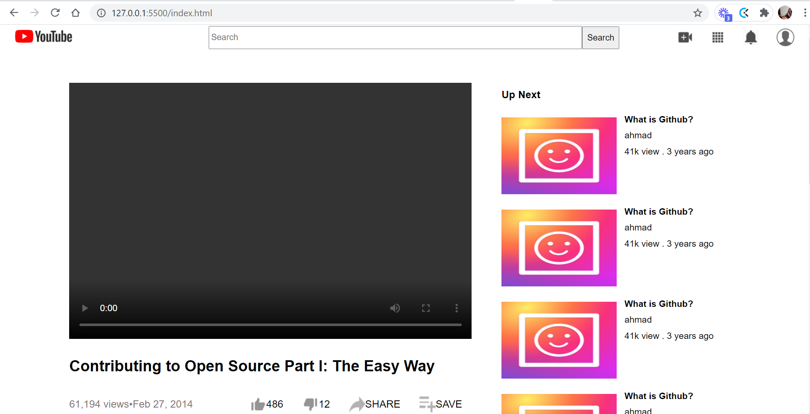

# Youtube Clone

> Youtube Clone is our First Project in Microverse

The goal of this project was to focus on making the media elements show up. We worked on embedding the YouTube video player into the page so it actually plays and showing little thumbnail images along the right side.

## Built With

- HTML
- CSS

## Live Demo

[Live Demo Link](https://pacyl2k19.github.io/youtube-clone/)

## Getting Started

1. Clone the project 
  `$ git clone https://github.com/pacyL2K19/youtube-clone `
2. Then open index.html in your browser

To get a local copy up and running follow these simple example steps.

### Prerequisites

Just ensure you have one or more web browsers

## Authors

👤 **Author1**

- GitHub: [@pacyL2K19](https://github.com/pacyL2K19)
- Twitter: [@PacifiqueLinja1](https://twitter.com/PacifiqueLinja1)
- LinkedIn: [LinkedIn](https://www.linkedin.com/in/pacifique-linjanja-2a565517b/)

👤 **Author2**

- GitHub: [@ahzia](https://github.com/ahzia)
- Twitter: [@ZiaYousofi](https://twitter.com/ZiaYousofi)
- LinkedIn: [LinkedIn](https://www.linkedin.com/in/ah-ziayosfi)

## 🤝 Contributing

Contributions, issues, and feature requests are welcome!
Feel free to contribute 
Feel free to check the [issues page](https://github.com/pacyL2K19/youtube-clone/issues/2).

## Show your support

Give a ⭐️ if you like this project!

